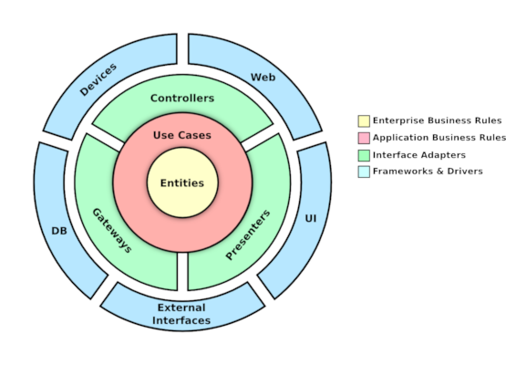

# Design de Código VS Arquitetura de Software

No mundo da tecnologia os **dados são reis**! Até porque o desenvolvimento de software no geral é a manipulação de dados conforme as necessidades dos usuários. Porém é justamente por isso que precisamos ter muito **cuidado ao iniciar um novo projeto**, sem os devidos planejamentos o projeto terá caracteristicas muito negativas que são:

* Ilegibilidade
* Inflexibilidade
* Falta de manutenibilidade
* Entre outros

Um projeto com essas caracteristicas pode até ser concluida, entretanto se for necessário algum ajuste ou atualização, os desenvolvedores vão ter muito esforço ou simplesmente não conseguirão sustentar esse projeto.

Por isso ao longo dos anos o ser humano foi desenvolvendo métodos de planejamento e filosofias para sempre manter os seus projetos o mais simples e organizado possível.

## Arquitetura de Software

Em tempos antigos ao construir um sistema, o código era construído como um monolito para todo tipo de projeto. **A problemática em si não é questão de usar monolitos, mas usá-la em TODO tipo de projeto.** Porque monolitos tem a desvantagem de todos os seus componentes serem interdependentes, o que com descuido pode acarretar em uma grande falta de manutenibilidade.

A *arquitetura de software* veio para isso! Esse conceito existe para mapear os componentes que existirão e como eles vão interagir entre eles. Atualmente tem várias estratégias de *arquitetura de software* que podem ser utilizadas nos projetos, como por exemplo:

* [MVC *(Model, View and Controller)*](https://www.treinaweb.com.br/blog/o-que-e-mvc/)
* [Layers *(Camadas)*](https://embarcados.com.br/arquitetura-de-software-em-camadas/)
* [Microservices *(Microsserviços)*](https://www.redhat.com/pt-br/topics/microservices/what-are-microservices)
* Entre outros

A intenção aqui não é detalhar de cada estratégia de *arquitetura de software* e então eleger a melhor estratégia, até porque **não existe a melhor estratégia mas sim as melhores estratégias para o seu projeto**. E para conseguir ter o senso critico de qual estratégia utilizar, apenas basta entender em essência que o seu projeto antes de tudo precisa ser mapeado e como será as interações dos componentes entre eles.

Iremos visualizar uma filosofia de arquitetura de software chamada [arquitetura limpa](https://www.techtarget.com/whatis/definition/clean-architecture).

Como podemos observar, ela é dividida entre 4 camadas:

* **Framework & Drivers**: Responsável pelas interações externas
* **Interface Adapters**: Responsável por encaminhar as informações adquiridas pelos *Framework & Drivers* para a aplicação de fato.
* **Use Cases**: Responsável pelo tratamento principal dos dados fornecidos externamente. Para ficar mais simples, aqui que fica a lógica e estrutura de pastas do projeto em si.
* **Entities**: Geralmente são objetos declarados ou modelos que dissertam as caracteristicas das *entidades* presentes no plano de negocios.

A intenção de citar essa filosofia porque justamente ela demonstra uma boa maneira de como **mapear e organizar os componentes**. Entretanto ela não é a fonte da verdade e pode-se basear em outras filosofias, desde que tenha uma *arquitetura de software* saudável no final das contas.

## Design de Código

Não basta só organizar a sua *arquitetura de software*, mas **adotar um padrão de design para manter o seu código organizado e flexivel é extremamente importante**. Afinal, se construirmos o código de uma maneira desleixada, o projeto pode sucumbir por causa das caracteristicas negativas citadas no inicio desse documento.

Portanto o *Design de código* tem a função importante de estabelecer essas regras dentro do código para as manter sempre organizadas e limpas. Temos alguns exemplos:

* [DDD *(Domain Drive Design)*](https://blog.betrybe.com/tecnologia/domain-driven-design/)
* [SOLID](https://medium.com/desenvolvendo-com-paixao/o-que-%C3%A9-solid-o-guia-completo-para-voc%C3%AA-entender-os-5-princ%C3%ADpios-da-poo-2b937b3fc530)
* [TDD *(Test Driven Development)*](https://blog.betrybe.com/tecnologia/tdd-test-driven-development/)
* [KISS *(Keep It Simple, Stupid)*](https://www.thiengo.com.br/kiss-mantenha-isso-estupidamente-simples)
* Entre outros

Novamente, não tem a melhor estratégia para se utilizar em um código. Mas sim qual a estratégia que o time está mais confortável em utilizar.
